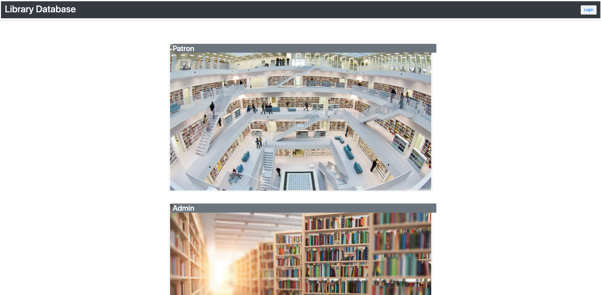

# CheckinOut

## User Story

* As a library go-er, I want to see what books are available at my local libary.
* As a libarian, I want to be able to manage my libary's databases for: library patrons, books, and administrators.

## User Interface Features

* Upon navigating to the landing page; the user has the option to choose the "Patron" or "Admin" dashboard
    * Patron
        * If the Patron route is clicked, the user will be prompted to sign in or sign up to continue.
        * Once the user logs in, they are presented with a list of books in the libary database.
        * From there, the user can navagative to the search engine, by clicking the search button in the top righthand corner. 
            * Accurate Search: This search feature allows users to search EXACT paramters of the book they want to search, if they know the full title, full author name, ISBN, etc. of the item they are looking for.
            * Blurry Search: This search feature allows users to search GENERAL keywords to look for a book that they want. (I.E. "Harry" to return all Harry Potter books in the database)
    * Admin
        * If the Admin route is clicked, the user will be promted to sign in as an admin. 
        * Once the admin logs in, they are presented with the "admin dashboard"
            * Use "admin@admin.com" and "AdminMaster12345" to log in initially.
            * In the admin dashboard, an admin can do two things: Add entrys to the three databases (Administators, Patrons, Books) or view the current collection of entries in the database

## CSS Frameworks
* Bootstrap: https://getbootstrap.com/docs/3.4/css/

## Technologies
* HTML
* CSS
* JavaScript/jQuery
* Node
* Express
* MySQL (Sequalize)

## Mock-Up

Landing Page: 
Login Page: 
Search Engine: 
Search Results:
Admin Dashboard:
Admin Database View:

## Links
* GitHub Repository: https://github.com/anthonypacella/CheckinOut
* Deployed Page: https://checkinout-app.herokuapp.com/

## Contributors
* Matthew Tanner, Sally Zhang, Sebastian Valderrama